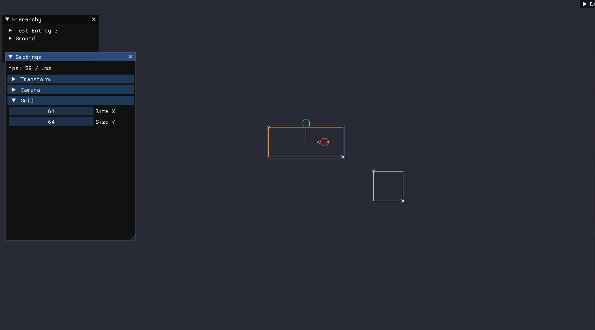

# galaxy

Is go-way 2d game engine (_work in progress_)

Stack:

- ECS (entity component system)
- Scenes hierarchy
- Immediate play mode (from editor)

Build on top of:

- SDL (render to openGL, inputs, sound)
- imgui (editor GUI)

## WIP (current state)

- last update: 2020_12_18
- version: 0.0.1



## Deps

SDL lib:

```bash
apt install libsdl2{,-image,-mixer,-ttf,-gfx}-dev
```

## How wo run

Examples not included for now. Also, you need some required assets directory with scene file

game `main.go`

```
package main

import (
	"flag"
	"os"

	"github.com/fe3dback/galaxy"
	"github.com/fe3dback/galaxy/cfg"
	"github.com/fe3dback/galaxy/scope/game/components/game"

	"github.com/fe3dback/galaxy-game/game/components/debug"
)

// -- flags
var isProfiling = flag.Bool("profile", false, "run in profile mode")
var profilingPort = flag.Int("profileport", 15600, "http port for profiling")
var fullScreen = flag.Bool("fullscreen", false, "run in fullscreen mode")
var screenWidth = flag.Int("screenwidth", 1280, "set screen width")
var screenHeight = flag.Int("screenheight", 720, "set screen height")

func main() {
	flag.Parse()
	conf := cfg.NewInitFlags(
		cfg.WithProfiling(*isProfiling, *profilingPort),
		cfg.WithScreen(*fullScreen, *screenWidth, *screenHeight),
		cfg.WithDebugOpts(true, false, false, false),
		cfg.WithIncludeEditor(true, false),

		// register game components
		// todo: auto register
		cfg.WithComponent(&game.LifeTime{}),
		cfg.WithComponent(&debug.Square{}),
		cfg.WithComponent(&debug.MoveOnX{}),
	)

	os.Exit(galaxy.NewGame(conf).Run())
}
```
